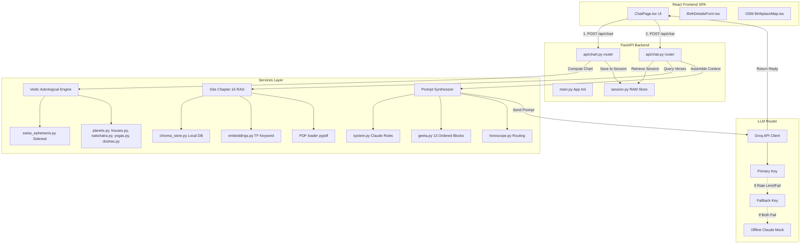
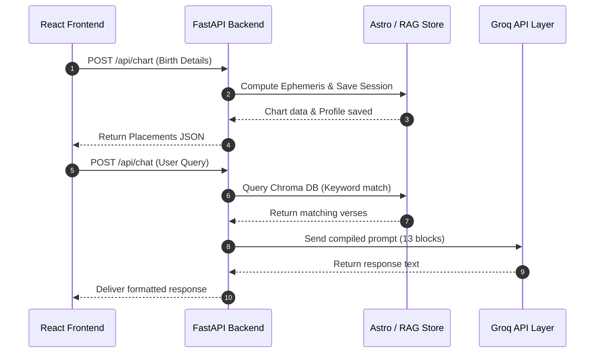
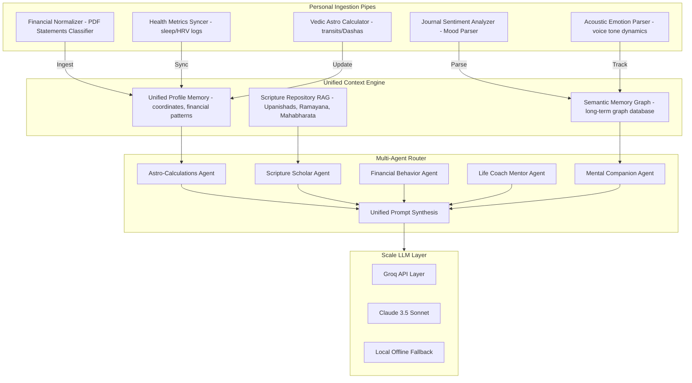

# System Architecture Specifications

## V1 Production Architecture

### V1 Component Architecture Relationships


---

### End-to-End Execution Flow Pipeline
```
User
  │
  ▼
React Frontend SPA
  │  (Payload: Name, DOB, TOB, Location Coordinates)
  ▼
FastAPI Router (/api/chart)
  │
  ▼
Session Validation (Check or Initialize Session ID)
  │
  ▼
Swiss Ephemeris (Calculate Sidereal Coordinates & Degrees)
  │
  ▼
Load Horoscope Context (Planets, Houses, Yogas, Doshas, Aspects, Strengths)
  │
  ▼
Intent Detection (Keywords: Career, Marriage, Health, wealth, Remedies, etc.)
  │
  ▼
Query Preprocessing (Tokenize question keys)
  │
  ▼
ChromaDB Retrieval (Extract Chapter 16 Bhagavad Gita passages)
  │
  ▼
Prompt Construction (Compile 13 ordered text blocks)
  │
  ▼
Groq LLM Pipeline (Process via Llama-3.3-70b-versatile with fallback retry)
  │
  ▼
Response Formatter (Vedic Astrologer persona Markdown formatting rules)
  │
  ▼
React Frontend (Uvicorn HTTP Response Delivery -> UI render)
```

---

### API Sequence Diagram


---

### Prompt Pipeline Order
```
1. System Instructions (Wise Astrologer & Mentor Claude-style persona)
  │
  ▼
2. Conversation History (Last 5 Turns from Session Cache)
  │
  ▼
3. User Intent Classification (Career, Health, Relationships, etc.)
  │
  ▼
4. Horoscope Context (Ascendant/Lagna, Moon Sign, Nakshatra, Pada)
  │
  ▼
5. Planetary Summary (Sanskrit names, degrees, houses, dignities, aspects)
  │
  ▼
6. Active Yogas (Gaja Kesari, Budhaditya, etc.)
  │
  ▼
7. Active Doshas (Manglik, Sade Sati, Kaal Sarp states)
  │
  ▼
8. Bhagavad Gita Context (Retrieved Chapter 16 shlokas)
  │
  ▼
9. User Question (Current query)
  │
  ▼
10. Groq Llama 3.3 API Request
```

---

### Session Management Spec
Each user session utilizes the following schema structure stored in-memory:
*   **Session ID**: Unique hash generated on client startup.
*   **Horoscope Cache**: Astrological coordinates, degrees, houses, dignities, and calculated yogas/doshas compiled during `/api/chart`. Saves compute power on future turns.
*   **Conversation History**: Array containing roles (`user`/`assistant`) and message contents of the active session context.
*   **User Profile Cache**: Saves birth details (Name, Date of Birth, Time of Birth, Coordinates, Timezone) to personalize LLM recommendations.
*   **API Key Storage**: Holds individual keys for authorization overrides.

---

### Core Technology Stack Matrix
| System Layer | Technology Implemented | Rationale / Scope |
| :--- | :--- | :--- |
| **Frontend** | React + TypeScript + Tailwind CSS | Sleek responsive web app UI bundle |
| **Backend** | FastAPI (Python 3.11) | Asynchronous API request handling |
| **Astrology** | Swiss Ephemeris (pyswisseph) | Sidereal planet positions |
| **Vector Database** | ChromaDB (Persistent Client) | Local disk-cached document storage |
| **Embeddings** | Custom Keyword Embedding (TF-based) | High-speed lightweight term matching |
| **RAG** | Chroma Retriever | Extracts Chapter 16 Gita passages |
| **LLM Layer** | Groq API (Llama 3.3 70B model) | Under 1-second generation speeds |
| **Maps & Geocoding** | OpenStreetMap + Nominatim API | Dynamic coordinate resolution |
| **Deployment** | Render Cloud Platform | Unified backend/frontend deployment |

---

### Deployment Specifications
*   **Frontend Web UI**: Hosted as a Render Static Site, building from the React frontend bundle.
*   **Backend API**: Hosted as a Render Web Service running Uvicorn.
*   **Vector Database Storage**: Uses a local ChromaDB instance (PersistentClient) initialized inside `backend/chroma_db/`. Suitable for prototype scaling.
*   **LLM Pipeline**: Routed to Groq's high-speed server endpoints.
*   **Deployment Version**: MVP v1 (Active Production Build).

---

### V1 Project Scope vs Future Roadmap
| V1 MVP Scope (Done) | Future Scale Scope |
| :--- | :--- |
| ✓ Birth Chart Lagna calculation | • Complete Bhagavad Gita RAG Integration |
| ✓ 3-Placements Horoscope Analysis | • Detailed Navamsa (D9) Chart analysis |
| ✓ Gita Chapter 16 RAG extraction | • Dasha periods timeline prediction |
| ✓ In-Memory Session Memory Cache | • Persistent Redis/SQL Database sessions |
| ✓ Primary & Fallback Groq key loop | • Managed Cloud Vector DB (Chroma Cloud) |

---

### Known Engineering Limitations
*   **Gita RAG Context**: The knowledge base is intentionally restricted to Chapter 16 (Divine and Demoniac qualities). Questions on other chapters fallback to default Vedic guidelines.
*   **Vector Store Durability**: ChromaDB is stored as local SQLite files on the web server instance. Render free tier container restarts will clear updates unless configured with persistent volume disks.
*   **Lightweight Embeddings**: Employs a custom term-frequency vectorizer. High-level conceptual matching (semantic synonyms) is limited compared to dense Transformers, but operates at virtually 0ms local compute overhead.
*   **Memory Lifetime**: Sessions are cached purely in-memory. Restarting the backend server process wipes past chat turns.

---

### Project Design System & Color Schema
The Kundli AI user interface employs a warm, grounding color system representing spiritual Vedic aesthetics (Vedic Kesari and Sandalwood Clay):
*   **Primary Kesari (`#E67E22`)**: Saffron orange, representing spiritual energy and active path.
*   **Secondary Gold (`#C89B3C`)**: Sandalwood gold, representing intellect and divine guidance.
*   **Background Cream (`#FAF8F3`)**: Holy Temple ivory, offering a soft, warm, calm surface.
*   **Primary Fixed Cream (`#FFF3E6`)**: Soft peach-cream used for containers and accents.
*   **Outline Sand (`#E9DFC8`)**: Sandalwood clay border lines separating sections.
*   **Charcoal Earth (`#2D2A26`)**: Dark charcoal used for high-contrast legible typography.

---
---

## Scale Expansion Architecture

### Future Unified Multimodal Scaling System


---

### Scalability Roadmap Pipeline
```
1. Current MVP (FastAPI + SQLite Chroma)
  │
  ▼
2. Containerization (Docker config)
  │
  ▼
3. Automated CI/CD Pipelines
  │
  ▼
4. Managed ChromaDB (Cloud deployment)
  │
  ▼
5. Distributed Session Layers (Redis cluster)
  │
  ▼
6. Relational Database Storage (PostgreSQL)
  │
  ▼
7. Security Layer (JWT & Auth0 integrations)
  │
  ▼
8. Orchestration Layer (Kubernetes pod scaling)
  │
  ▼
9. Highly Available Enterprise Production
```

---

### Future Scaling Details
*   **Chroma DB Cloud Migration**: Moving local folder mounts to managed cloud clusters, ensuring instant index retrieval and document scalability for all scripture libraries.
*   **Relational Profile Syncing**: Implementing PostgreSQL to store user demographics and calculated sidereal charts permanently.
*   **Redis Session Store**: Shifting in-memory caches to a Redis session cluster, preserving conversation histories across backend auto-scaling instances.
*   **Multi-Agent Orchestrator**: Routing distinct user intents (e.g. finance, relationships) to specialized subprocess agents before synthesizing a unified, Claude-style mentorship response.
