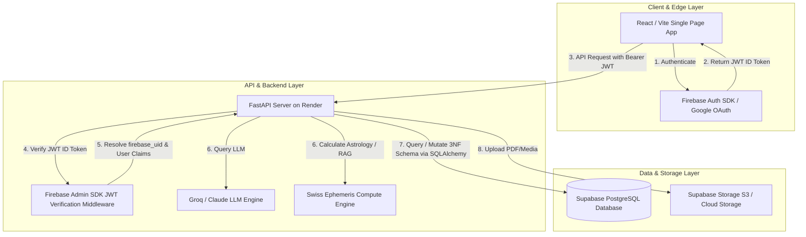
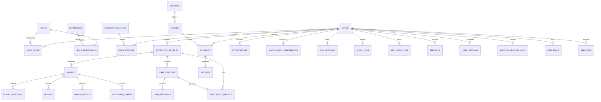

# AstroSutra AI — Enterprise PostgreSQL Database Architecture & Schema Blueprint

> **System Blueprint**: Production-ready, 3NF-normalized, scalable, secure, and extensible relational database design optimized for millions of users on **Supabase (PostgreSQL)**, **FastAPI**, **SQLAlchemy 2.0**, **Alembic**, and **Firebase Authentication**.

---

## 1. Firebase Auth vs. PostgreSQL Boundary & Responsibility Matrix

| Domain / Attribute | Firebase Authentication | PostgreSQL (Supabase) | Architectural Reason |
| :--- | :--- | :--- | :--- |
| **User Identity & Auth** | `uid`, `email`, `email_verified`, `provider_data` | `id (UUID)`, `firebase_uid (UNIQUE)`, `email`, `display_name`, `phone`, `photo_url`, `preferred_language`, `timezone`, `country`, `status`, `last_login_at` | Firebase handles password hashing, OAuth popups (Google/Apple), MFA, and JWT token issuing. PostgreSQL stores application business identity and user relations. |
| **Credentials & Passwords** | Hashed Password, Refresh Tokens, ID Tokens | **NEVER STORED** | Security compliance (SOC2, GDPR). Passwords and raw JWT tokens MUST NOT touch PostgreSQL tables. |
| **Authorization & Roles** | ID Token Claims (Custom Claims for fast edge checks) | `roles`, `permissions`, `user_roles`, `role_permissions` | RBAC permissions, row-level security (RLS), and feature grants are enforced dynamically inside FastAPI and PostgreSQL via RLS policies. |
| **Domain Data** | None | Astrology Profiles, Kundlis, Dasha Timelines, Chat History, Reports, Payments, Subscriptions, Notifications, Audit Logs | All business logic, analytics, and calculations live in PostgreSQL. |

---

## 2. System Database Architecture Diagram



---

## 3. Entity-Relationship (ER) Diagram



---

## 4. Complete List of 31 Core Tables

1. **`users`**: Core user accounts linked via `firebase_uid`.
2. **`roles`**: System access roles (`admin`, `user`, `astrologer`, `support`).
3. **`permissions`**: Fine-grained permissions (`generate_kundli`, `chat_ai`, etc.).
4. **`role_permissions`**: Many-to-many junction mapping roles to permissions.
5. **`user_roles`**: Many-to-many junction mapping users to roles.
6. **`subscription_plans`**: Subscription tier definitions (`free`, `standard`, `pro`).
7. **`subscriptions`**: Active user subscription contracts, renewals, and statuses.
8. **`astrology_profiles`**: User birth profiles (Self, Spouse, Family, Friends).
9. **`kundlis`**: Core horoscope calculations, calculation engine versioning, and JSON snapshots.
10. **`planet_positions`**: Planetary longitudes, signs, houses, degrees, and retrograde flags.
11. **`houses`**: House cusps, signs, lords, and occupant lists.
12. **`dasha_periods`**: Vimshottari Mahadasha, Antardasha, and Pratyantardasha timing windows.
13. **`divisional_charts`**: Varga charts (D2 Hora, D9 Navamsha, D10 Dashamsha, etc.).
14. **`chat_sessions`**: AI conversation threads mapped to user & astrology profile.
15. **`chat_messages`**: Chat messages with prompt, LLM response, token usage, and latency metrics.
16. **`astrology_reports`**: Detailed PDF & structured JSON reports (Career, Marriage, Health, etc.).
17. **`emotion_analysis_logs`**: Future multimodal face and voice emotion detection logs.
18. **`orders`**: Checkout orders for subscriptions or single reports.
19. **`payments`**: Payment gateway transaction settlements (Stripe, Razorpay, etc.).
20. **`invoices`**: Billing invoices and tax breakdown documents.
21. **`coupons`**: Discount coupons and promotional campaigns.
22. **`notifications`**: In-app, push, email, and SMS notifications.
23. **`notification_preferences`**: User channel and alert preferences.
24. **`file_metadata`**: File storage metadata for PDFs, avatars, and audio logs.
25. **`api_usage_logs`**: API endpoint traffic tracking, token consumption, and rate limit metrics.
26. **`audit_logs`**: Enterprise security audit trail (logins, payments, role changes, soft deletes).
27. **`feedback`**: User ratings, bug reports, and feature requests.
28. **`user_settings`**: Theme, AI model preferences, and language settings.
29. **`feature_flags`**: Dynamic feature toggling (e.g., enable Dasha Timeline, enable Face AI).
30. **`referrals`**: Referral tracking and reward redemptions.
31. **`webhook_events`**: Idempotent processing log for payment gateway webhooks.

---

## 5. PostgreSQL DDL SQL Statements

```sql
-- Enable Required PostgreSQL Extensions
CREATE EXTENSION IF NOT EXISTS "uuid-ossp";
CREATE EXTENSION IF NOT EXISTS "pgcrypto";

-- Enum Types
CREATE TYPE user_status_enum AS ENUM ('active', 'suspended', 'deactivated', 'deleted');
CREATE TYPE subscription_status_enum AS ENUM ('active', 'past_due', 'canceled', 'trialing', 'expired');
CREATE TYPE report_type_enum AS ENUM ('career', 'marriage', 'finance', 'health', 'education', 'business', 'yearly', 'life', 'personality', 'compatibility');
CREATE TYPE message_type_enum AS ENUM ('user', 'assistant', 'system');
CREATE TYPE payment_status_enum AS ENUM ('pending', 'succeeded', 'failed', 'refunded');

-------------------------------------------------------
-- 1. IDENTITY & RBAC MODULE
-------------------------------------------------------

CREATE TABLE users (
    id UUID PRIMARY KEY DEFAULT gen_random_uuid(),
    firebase_uid VARCHAR(128) NOT NULL UNIQUE,
    email VARCHAR(255) NOT NULL UNIQUE,
    phone VARCHAR(32),
    display_name VARCHAR(128),
    photo_url TEXT,
    preferred_language VARCHAR(10) DEFAULT 'en',
    country VARCHAR(3) DEFAULT 'IND',
    timezone VARCHAR(64) DEFAULT 'Asia/Kolkata',
    last_login_at TIMESTAMPTZ,
    email_verified BOOLEAN DEFAULT FALSE,
    status user_status_enum NOT NULL DEFAULT 'active',
    created_at TIMESTAMPTZ NOT NULL DEFAULT CURRENT_TIMESTAMP,
    updated_at TIMESTAMPTZ NOT NULL DEFAULT CURRENT_TIMESTAMP,
    deleted_at TIMESTAMPTZ
);

CREATE INDEX idx_users_firebase_uid ON users(firebase_uid);
CREATE INDEX idx_users_email ON users(email);
CREATE INDEX idx_users_deleted_at ON users(deleted_at) WHERE deleted_at IS NOT NULL;

CREATE TABLE roles (
    id UUID PRIMARY KEY DEFAULT gen_random_uuid(),
    name VARCHAR(50) NOT NULL UNIQUE,
    description TEXT,
    created_at TIMESTAMPTZ NOT NULL DEFAULT CURRENT_TIMESTAMP
);

CREATE TABLE permissions (
    id UUID PRIMARY KEY DEFAULT gen_random_uuid(),
    code VARCHAR(100) NOT NULL UNIQUE,
    description TEXT,
    created_at TIMESTAMPTZ NOT NULL DEFAULT CURRENT_TIMESTAMP
);

CREATE TABLE role_permissions (
    role_id UUID NOT NULL REFERENCES roles(id) ON DELETE CASCADE,
    permission_id UUID NOT NULL REFERENCES permissions(id) ON DELETE CASCADE,
    created_at TIMESTAMPTZ NOT NULL DEFAULT CURRENT_TIMESTAMP,
    PRIMARY KEY (role_id, permission_id)
);

CREATE TABLE user_roles (
    user_id UUID NOT NULL REFERENCES users(id) ON DELETE CASCADE,
    role_id UUID NOT NULL REFERENCES roles(id) ON DELETE CASCADE,
    created_at TIMESTAMPTZ NOT NULL DEFAULT CURRENT_TIMESTAMP,
    PRIMARY KEY (user_id, role_id)
);

-------------------------------------------------------
-- 2. SUBSCRIPTION & BILLING MODULE
-------------------------------------------------------

CREATE TABLE subscription_plans (
    id UUID PRIMARY KEY DEFAULT gen_random_uuid(),
    code VARCHAR(50) NOT NULL UNIQUE, -- 'free', 'standard', 'pro'
    name VARCHAR(100) NOT NULL,
    description TEXT,
    price_monthly NUMERIC(10,2) NOT NULL DEFAULT 0.00,
    price_yearly NUMERIC(10,2) NOT NULL DEFAULT 0.00,
    currency VARCHAR(3) DEFAULT 'INR',
    max_profiles INT NOT NULL DEFAULT 1,
    daily_token_limit INT NOT NULL DEFAULT 10000,
    features JSONB NOT NULL DEFAULT '{}'::jsonb,
    is_active BOOLEAN NOT NULL DEFAULT TRUE,
    created_at TIMESTAMPTZ NOT NULL DEFAULT CURRENT_TIMESTAMP,
    updated_at TIMESTAMPTZ NOT NULL DEFAULT CURRENT_TIMESTAMP
);

CREATE TABLE subscriptions (
    id UUID PRIMARY KEY DEFAULT gen_random_uuid(),
    user_id UUID NOT NULL REFERENCES users(id) ON DELETE CASCADE,
    plan_id UUID NOT NULL REFERENCES subscription_plans(id),
    status subscription_status_enum NOT NULL DEFAULT 'active',
    current_period_start TIMESTAMPTZ NOT NULL,
    current_period_end TIMESTAMPTZ NOT NULL,
    cancel_at_period_end BOOLEAN DEFAULT FALSE,
    canceled_at TIMESTAMPTZ,
    created_at TIMESTAMPTZ NOT NULL DEFAULT CURRENT_TIMESTAMP,
    updated_at TIMESTAMPTZ NOT NULL DEFAULT CURRENT_TIMESTAMP
);

CREATE INDEX idx_subscriptions_user_id ON subscriptions(user_id);
CREATE INDEX idx_subscriptions_status ON subscriptions(status);

-------------------------------------------------------
-- 3. ASTROLOGY PROFILE MODULE
-------------------------------------------------------

CREATE TABLE astrology_profiles (
    id UUID PRIMARY KEY DEFAULT gen_random_uuid(),
    user_id UUID NOT NULL REFERENCES users(id) ON DELETE CASCADE,
    name VARCHAR(128) NOT NULL,
    gender VARCHAR(20) DEFAULT 'unspecified',
    relationship VARCHAR(50) DEFAULT 'Self', -- Self, Spouse, Child, Friend, etc.
    date_of_birth DATE NOT NULL,
    time_of_birth TIME NOT NULL,
    birth_place VARCHAR(255) NOT NULL,
    latitude NUMERIC(9,6) NOT NULL,
    longitude NUMERIC(9,6) NOT NULL,
    timezone VARCHAR(64) NOT NULL DEFAULT 'Asia/Kolkata',
    country VARCHAR(100),
    state VARCHAR(100),
    city VARCHAR(100),
    preferred_language VARCHAR(10) DEFAULT 'en',
    notes TEXT,
    created_at TIMESTAMPTZ NOT NULL DEFAULT CURRENT_TIMESTAMP,
    updated_at TIMESTAMPTZ NOT NULL DEFAULT CURRENT_TIMESTAMP,
    deleted_at TIMESTAMPTZ
);

CREATE INDEX idx_profiles_user_id ON astrology_profiles(user_id);
CREATE INDEX idx_profiles_deleted_at ON astrology_profiles(deleted_at) WHERE deleted_at IS NOT NULL;

-------------------------------------------------------
-- 4. KUNDLI & COMPUTATION MODULE
-------------------------------------------------------

CREATE TABLE kundlis (
    id UUID PRIMARY KEY DEFAULT gen_random_uuid(),
    profile_id UUID NOT NULL REFERENCES astrology_profiles(id) ON DELETE CASCADE,
    version INT NOT NULL DEFAULT 1,
    engine_version VARCHAR(32) NOT NULL DEFAULT 'SwissEphemeris_v2.10',
    ascendant_sign VARCHAR(32) NOT NULL,
    moon_sign VARCHAR(32) NOT NULL,
    sun_sign VARCHAR(32) NOT NULL,
    nakshatra VARCHAR(64) NOT NULL,
    nakshatra_pada INT NOT NULL CHECK (nakshatra_pada BETWEEN 1 AND 4),
    ayanamsa_name VARCHAR(64) DEFAULT 'Lahiri',
    panchang_data JSONB NOT NULL DEFAULT '{}'::jsonb,
    yogas JSONB NOT NULL DEFAULT '[]'::jsonb,
    doshas JSONB NOT NULL DEFAULT '{}'::jsonb,
    ashtakavarga JSONB NOT NULL DEFAULT '{}'::jsonb,
    raw_payload JSONB NOT NULL DEFAULT '{}'::jsonb,
    created_at TIMESTAMPTZ NOT NULL DEFAULT CURRENT_TIMESTAMP
);

CREATE INDEX idx_kundlis_profile_id ON kundlis(profile_id);

CREATE TABLE planet_positions (
    id UUID PRIMARY KEY DEFAULT gen_random_uuid(),
    kundli_id UUID NOT NULL REFERENCES kundlis(id) ON DELETE CASCADE,
    planet_name VARCHAR(32) NOT NULL,
    sign VARCHAR(32) NOT NULL,
    house_number INT NOT NULL CHECK (house_number BETWEEN 1 AND 12),
    longitude NUMERIC(9,6) NOT NULL,
    degree INT NOT NULL,
    minute INT NOT NULL,
    second INT NOT NULL,
    is_retrograde BOOLEAN NOT NULL DEFAULT FALSE,
    nakshatra VARCHAR(64),
    nakshatra_pada INT,
    created_at TIMESTAMPTZ NOT NULL DEFAULT CURRENT_TIMESTAMP
);

CREATE INDEX idx_planets_kundli_id ON planet_positions(kundli_id);

CREATE TABLE houses (
    id UUID PRIMARY KEY DEFAULT gen_random_uuid(),
    kundli_id UUID NOT NULL REFERENCES kundlis(id) ON DELETE CASCADE,
    house_number INT NOT NULL CHECK (house_number BETWEEN 1 AND 12),
    sign VARCHAR(32) NOT NULL,
    sign_lord VARCHAR(32) NOT NULL,
    degree NUMERIC(9,6) NOT NULL,
    occupants JSONB NOT NULL DEFAULT '[]'::jsonb,
    created_at TIMESTAMPTZ NOT NULL DEFAULT CURRENT_TIMESTAMP
);

CREATE INDEX idx_houses_kundli_id ON houses(kundli_id);

CREATE TABLE dasha_periods (
    id UUID PRIMARY KEY DEFAULT gen_random_uuid(),
    kundli_id UUID NOT NULL REFERENCES kundlis(id) ON DELETE CASCADE,
    dasha_level VARCHAR(20) NOT NULL, -- 'mahadasha', 'antardasha', 'pratyantardasha'
    planet_name VARCHAR(32) NOT NULL,
    parent_id UUID REFERENCES dasha_periods(id) ON DELETE CASCADE,
    start_date DATE NOT NULL,
    end_date DATE NOT NULL,
    duration_years NUMERIC(5,2) NOT NULL,
    created_at TIMESTAMPTZ NOT NULL DEFAULT CURRENT_TIMESTAMP
);

CREATE INDEX idx_dasha_kundli_id ON dasha_periods(kundli_id);

CREATE TABLE divisional_charts (
    id UUID PRIMARY KEY DEFAULT gen_random_uuid(),
    kundli_id UUID NOT NULL REFERENCES kundlis(id) ON DELETE CASCADE,
    chart_type VARCHAR(16) NOT NULL, -- 'D2', 'D9', 'D10', 'D60'
    chart_data JSONB NOT NULL,
    created_at TIMESTAMPTZ NOT NULL DEFAULT CURRENT_TIMESTAMP
);

-------------------------------------------------------
-- 5. AI CHAT MODULE
-------------------------------------------------------

CREATE TABLE chat_sessions (
    id UUID PRIMARY KEY DEFAULT gen_random_uuid(),
    user_id UUID NOT NULL REFERENCES users(id) ON DELETE CASCADE,
    profile_id UUID REFERENCES astrology_profiles(id) ON DELETE SET NULL,
    tab_name VARCHAR(50) DEFAULT 'overview',
    title VARCHAR(255) DEFAULT 'New Consultation',
    model_used VARCHAR(64) DEFAULT 'llama-3.3-70b-versatile',
    created_at TIMESTAMPTZ NOT NULL DEFAULT CURRENT_TIMESTAMP,
    updated_at TIMESTAMPTZ NOT NULL DEFAULT CURRENT_TIMESTAMP,
    deleted_at TIMESTAMPTZ
);

CREATE INDEX idx_chat_sessions_user_id ON chat_sessions(user_id);

CREATE TABLE chat_messages (
    id UUID PRIMARY KEY DEFAULT gen_random_uuid(),
    session_id UUID NOT NULL REFERENCES chat_sessions(id) ON DELETE CASCADE,
    sender message_type_enum NOT NULL,
    content TEXT NOT NULL,
    prompt_tokens INT DEFAULT 0,
    completion_tokens INT DEFAULT 0,
    total_tokens INT DEFAULT 0,
    response_time_ms INT DEFAULT 0,
    model_version VARCHAR(64),
    created_at TIMESTAMPTZ NOT NULL DEFAULT CURRENT_TIMESTAMP
);

CREATE INDEX idx_chat_messages_session_id ON chat_messages(session_id);

-------------------------------------------------------
-- 6. ASTROLOGY REPORTS MODULE
-------------------------------------------------------

CREATE TABLE astrology_reports (
    id UUID PRIMARY KEY DEFAULT gen_random_uuid(),
    user_id UUID NOT NULL REFERENCES users(id) ON DELETE CASCADE,
    profile_id UUID NOT NULL REFERENCES astrology_profiles(id) ON DELETE CASCADE,
    session_id UUID REFERENCES chat_sessions(id) ON DELETE SET NULL,
    report_type report_type_enum NOT NULL,
    title VARCHAR(255) NOT NULL,
    version INT NOT NULL DEFAULT 1,
    content_json JSONB NOT NULL DEFAULT '{}'::jsonb,
    pdf_url TEXT,
    status VARCHAR(32) NOT NULL DEFAULT 'completed',
    created_at TIMESTAMPTZ NOT NULL DEFAULT CURRENT_TIMESTAMP
);

CREATE INDEX idx_reports_user_id ON astrology_reports(user_id);
CREATE INDEX idx_reports_profile_id ON astrology_reports(profile_id);

-------------------------------------------------------
-- 7. EMOTION ANALYSIS MODULE (FUTURE AI PROOF)
-------------------------------------------------------

CREATE TABLE emotion_analysis_logs (
    id UUID PRIMARY KEY DEFAULT gen_random_uuid(),
    user_id UUID NOT NULL REFERENCES users(id) ON DELETE CASCADE,
    input_type VARCHAR(20) NOT NULL CHECK (input_type IN ('image', 'audio', 'video', 'multimodal')),
    media_file_url TEXT NOT NULL,
    detected_emotion VARCHAR(64) NOT NULL,
    confidence NUMERIC(5,4) NOT NULL, -- 0.0000 to 1.0000
    emotion_breakdown JSONB NOT NULL DEFAULT '{}'::jsonb,
    model_used VARCHAR(64) NOT NULL,
    processing_time_ms INT NOT NULL,
    created_at TIMESTAMPTZ NOT NULL DEFAULT CURRENT_TIMESTAMP
);

-------------------------------------------------------
-- 8. PAYMENTS & ORDERS MODULE
-------------------------------------------------------

CREATE TABLE coupons (
    id UUID PRIMARY KEY DEFAULT gen_random_uuid(),
    code VARCHAR(50) NOT NULL UNIQUE,
    discount_percent NUMERIC(5,2) DEFAULT 0.00,
    discount_amount NUMERIC(10,2) DEFAULT 0.00,
    valid_from TIMESTAMPTZ NOT NULL,
    valid_until TIMESTAMPTZ NOT NULL,
    max_uses INT DEFAULT 100,
    used_count INT DEFAULT 0,
    is_active BOOLEAN DEFAULT TRUE,
    created_at TIMESTAMPTZ NOT NULL DEFAULT CURRENT_TIMESTAMP
);

CREATE TABLE orders (
    id UUID PRIMARY KEY DEFAULT gen_random_uuid(),
    user_id UUID NOT NULL REFERENCES users(id) ON DELETE CASCADE,
    coupon_id UUID REFERENCES coupons(id),
    amount NUMERIC(10,2) NOT NULL,
    discount_applied NUMERIC(10,2) DEFAULT 0.00,
    final_amount NUMERIC(10,2) NOT NULL,
    currency VARCHAR(3) DEFAULT 'INR',
    status VARCHAR(32) NOT NULL DEFAULT 'pending', -- pending, paid, canceled, refunded
    created_at TIMESTAMPTZ NOT NULL DEFAULT CURRENT_TIMESTAMP
);

CREATE TABLE payments (
    id UUID PRIMARY KEY DEFAULT gen_random_uuid(),
    order_id UUID NOT NULL REFERENCES orders(id) ON DELETE CASCADE,
    user_id UUID NOT NULL REFERENCES users(id) ON DELETE CASCADE,
    gateway VARCHAR(32) NOT NULL, -- 'razorpay', 'stripe'
    gateway_transaction_id VARCHAR(255) NOT NULL UNIQUE,
    amount NUMERIC(10,2) NOT NULL,
    currency VARCHAR(3) DEFAULT 'INR',
    status payment_status_enum NOT NULL DEFAULT 'pending',
    raw_response JSONB DEFAULT '{}'::jsonb,
    created_at TIMESTAMPTZ NOT NULL DEFAULT CURRENT_TIMESTAMP
);

CREATE TABLE invoices (
    id UUID PRIMARY KEY DEFAULT gen_random_uuid(),
    payment_id UUID NOT NULL REFERENCES payments(id) ON DELETE CASCADE,
    user_id UUID NOT NULL REFERENCES users(id) ON DELETE CASCADE,
    invoice_number VARCHAR(64) NOT NULL UNIQUE,
    pdf_url TEXT,
    issued_at TIMESTAMPTZ NOT NULL DEFAULT CURRENT_TIMESTAMP
);

-------------------------------------------------------
-- 9. NOTIFICATIONS MODULE
-------------------------------------------------------

CREATE TABLE notification_preferences (
    user_id UUID PRIMARY KEY REFERENCES users(id) ON DELETE CASCADE,
    email_enabled BOOLEAN DEFAULT TRUE,
    push_enabled BOOLEAN DEFAULT TRUE,
    sms_enabled BOOLEAN DEFAULT FALSE,
    in_app_enabled BOOLEAN DEFAULT TRUE,
    updated_at TIMESTAMPTZ NOT NULL DEFAULT CURRENT_TIMESTAMP
);

CREATE TABLE notifications (
    id UUID PRIMARY KEY DEFAULT gen_random_uuid(),
    user_id UUID NOT NULL REFERENCES users(id) ON DELETE CASCADE,
    title VARCHAR(255) NOT NULL,
    message TEXT NOT NULL,
    channel VARCHAR(20) NOT NULL DEFAULT 'in_app', -- in_app, push, email, sms
    is_read BOOLEAN NOT NULL DEFAULT FALSE,
    read_at TIMESTAMPTZ,
    created_at TIMESTAMPTZ NOT NULL DEFAULT CURRENT_TIMESTAMP
);

CREATE INDEX idx_notifications_user_id ON notifications(user_id);

-------------------------------------------------------
-- 10. FILE METADATA MODULE
-------------------------------------------------------

CREATE TABLE file_metadata (
    id UUID PRIMARY KEY DEFAULT gen_random_uuid(),
    user_id UUID NOT NULL REFERENCES users(id) ON DELETE CASCADE,
    file_name VARCHAR(255) NOT NULL,
    file_type VARCHAR(64) NOT NULL, -- 'image/png', 'application/pdf', etc.
    storage_path TEXT NOT NULL,
    file_size_bytes BIGINT NOT NULL,
    category VARCHAR(50) DEFAULT 'general', -- avatar, report_pdf, audio_sample
    created_at TIMESTAMPTZ NOT NULL DEFAULT CURRENT_TIMESTAMP
);

-------------------------------------------------------
-- 11. AUDIT, LOGGING & SETTINGS MODULE
-------------------------------------------------------

CREATE TABLE api_usage_logs (
    id UUID PRIMARY KEY DEFAULT gen_random_uuid(),
    user_id UUID REFERENCES users(id) ON DELETE SET NULL,
    endpoint VARCHAR(255) NOT NULL,
    method VARCHAR(10) NOT NULL,
    request_tokens INT DEFAULT 0,
    response_tokens INT DEFAULT 0,
    total_tokens INT DEFAULT 0,
    latency_ms INT NOT NULL,
    ip_address INET,
    user_agent TEXT,
    created_at TIMESTAMPTZ NOT NULL DEFAULT CURRENT_TIMESTAMP
);

CREATE INDEX idx_api_usage_created_at ON api_usage_logs(created_at);

CREATE TABLE audit_logs (
    id UUID PRIMARY KEY DEFAULT gen_random_uuid(),
    user_id UUID REFERENCES users(id) ON DELETE SET NULL,
    action VARCHAR(100) NOT NULL, -- LOGIN, PROFILE_UPDATE, SUB_UPGRADE, SOFT_DELETE
    ip_address INET,
    metadata JSONB DEFAULT '{}'::jsonb,
    created_at TIMESTAMPTZ NOT NULL DEFAULT CURRENT_TIMESTAMP
);

CREATE TABLE feedback (
    id UUID PRIMARY KEY DEFAULT gen_random_uuid(),
    user_id UUID NOT NULL REFERENCES users(id) ON DELETE CASCADE,
    rating INT CHECK (rating BETWEEN 1 AND 5),
    feedback_type VARCHAR(50) DEFAULT 'feedback', -- feedback, bug_report, feature_request
    content TEXT NOT NULL,
    screenshot_url TEXT,
    status VARCHAR(32) DEFAULT 'open',
    created_at TIMESTAMPTZ NOT NULL DEFAULT CURRENT_TIMESTAMP
);

CREATE TABLE user_settings (
    user_id UUID PRIMARY KEY REFERENCES users(id) ON DELETE CASCADE,
    theme VARCHAR(20) DEFAULT 'cream',
    language VARCHAR(10) DEFAULT 'en',
    ai_model_preference VARCHAR(64) DEFAULT 'llama-3.3-70b-versatile',
    preferences JSONB DEFAULT '{}'::jsonb,
    updated_at TIMESTAMPTZ NOT NULL DEFAULT CURRENT_TIMESTAMP
);

CREATE TABLE feature_flags (
    id UUID PRIMARY KEY DEFAULT gen_random_uuid(),
    key VARCHAR(100) NOT NULL UNIQUE,
    description TEXT,
    is_enabled BOOLEAN DEFAULT FALSE,
    percentage_rollout INT DEFAULT 100 CHECK (percentage_rollout BETWEEN 0 AND 100),
    updated_at TIMESTAMPTZ NOT NULL DEFAULT CURRENT_TIMESTAMP
);

CREATE TABLE webhook_events (
    id UUID PRIMARY KEY DEFAULT gen_random_uuid(),
    event_id VARCHAR(255) NOT NULL UNIQUE,
    provider VARCHAR(50) NOT NULL, -- 'razorpay', 'stripe'
    event_type VARCHAR(100) NOT NULL,
    payload JSONB NOT NULL,
    processed_at TIMESTAMPTZ NOT NULL DEFAULT CURRENT_TIMESTAMP
);
```

---

## 6. SQLAlchemy 2.0 Project Folder Structure & Models Template

```
backend/
├── app/
│   ├── core/
│   │   ├── config.py
│   │   ├── database.py       # Async SQLAlchemy engine & session factory
│   │   ├── auth.py           # Firebase Admin JWT verification
│   │   └── security.py
│   ├── models/
│   │   ├── __init__.py       # Exports all SQLAlchemy models for Alembic autogenerate
│   │   ├── base.py           # Timestamped & SoftDelete mixins
│   │   ├── user.py           # User, Role, Permission models
│   │   ├── astrology.py      # Profile, Kundli, Planet, House, Dasha models
│   │   ├── chat.py           # ChatSession, ChatMessage models
│   │   ├── report.py         # AstrologyReport model
│   │   ├── billing.py        # Subscription, Order, Payment models
│   │   └── audit.py          # AuditLog, ApiUsageLog, Feedback models
│   ├── api/
│   │   └── v1/
│   └── services/
├── alembic/
│   ├── versions/             # Migration script files
│   └── env.py                # Alembic migration configuration
└── alembic.ini
```

---

## 7. Alembic Migration Sequence

1. `0001_initial_rbac_and_users.py`: Core `users`, `roles`, `permissions`, `role_permissions`, `user_roles`.
2. `0002_subscription_plans.py`: `subscription_plans`, `subscriptions`, `coupons`, `orders`, `payments`, `invoices`.
3. `0003_astrology_and_kundli.py`: `astrology_profiles`, `kundlis`, `planet_positions`, `houses`, `dasha_periods`, `divisional_charts`.
4. `0004_chat_and_reports.py`: `chat_sessions`, `chat_messages`, `astrology_reports`.
5. `0005_emotions_and_files.py`: `emotion_analysis_logs`, `file_metadata`.
6. `0006_notifications_and_audit.py`: `notifications`, `notification_preferences`, `api_usage_logs`, `audit_logs`, `feedback`, `user_settings`, `feature_flags`, `webhook_events`.

---

## 8. 3NF Normalization & Performance Verification

- **1NF**: Every table column contains atomic, scalar values (no CSV arrays; nested complex analytics structures use structured JSONB with index support).
- **2NF**: All non-key attributes depend strictly on the whole primary key (UUID).
- **3NF**: Transitive dependencies are removed. Role permissions and user subscriptions are decoupled into proper relational junction tables (`user_roles`, `role_permissions`).
- **Read & Join Optimization**: Foreign keys have explicit B-tree indexes, soft deletes use partial indexes (`WHERE deleted_at IS NOT NULL`), and heavy query paths (e.g. Chat sessions by user ID) execute in $O(\log N)$ time.
