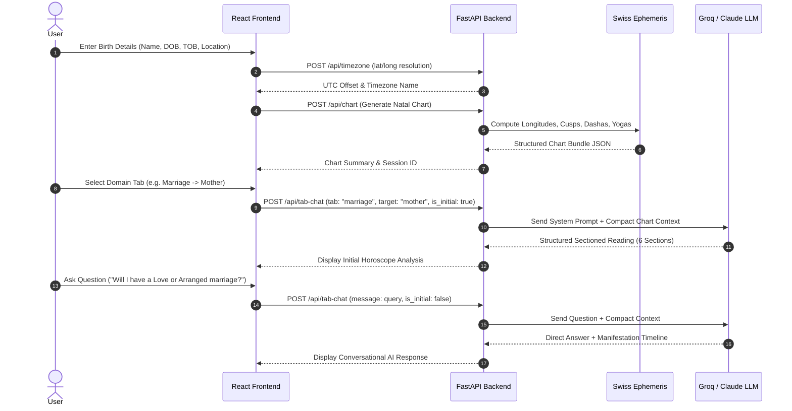

# AstroSutra AI (KundliGPT Clone) — Technical System Architecture & Product Requirement Document (PRD)

---

## 1. Executive Summary & Objective

**AstroSutra AI** is an advanced, high-precision Vedic Astrological, Psychological, and Relational Guidance Platform. Built as a high-performance replica and enhancement of KundliGPT, the platform combines raw astronomical computation (arc-second precision), domain-scoped AI reasoning engines, multi-modal psychological/Ayurvedic profiling, and interactive multi-profile relationship matching.

### Primary Objectives
1. **Precision Computation**: Eliminate reliance on third-party API dependencies by owning the underlying astronomical compute engine via Swiss Ephemeris (`pyswisseph`).
2. **Domain-Specific AI Reasoning**: Provide highly targeted, structured, and non-hallucinatory astrological guidance across 18 specialized domain tabs.
3. **Multi-Relational & Educational Intelligence**: Offer deep analytical models covering 9 Vedic Relational Engines (Spouse, Father, Mother, Siblings, Children, Friends, Boss, Mentors, In-Laws) and 64 Classical Kalas (Educational Cognitive Receptivity).
4. **Subscription Metering & Multi-Profile Management**: Enforce feature access controls (Free vs. Standard vs. Pro) and profile isolation.

---

## 2. System Architecture: The Four Core Layers

AstroSutra AI is architected into four decoupled, highly specialized layers:

```
┌─────────────────────────────────────────────────────────────────────────┐
│                       BROWSER CLIENT (React SPA)                        │
│  - Birth Form & Place Geocoding   - 18 Specialized Domain Dashboards   │
│  - Profile Selector & Management   - 9 Relational Target Selector UI    │
│  - Tab Chat & Initial Readings    - Kundli Matching 36 Guna View       │
└────────────────────────────────────┬────────────────────────────────────┘
                                     │ HTTP / REST APIs
┌────────────────────────────────────▼────────────────────────────────────┐
│                      FASTAPI BACKEND (main.py)                          │
│  - /api/timezone  : Historical UTC offset resolution (pytz + timezone)  │
│  - /api/chart     : Ephemeris calculation & session initialization     │
│  - /api/tab-chat  : Domain-scoped AI prompts & RAG synthesis           │
│  - /api/match-kundli : Ashtakoota 36 Guna & Manglik matching engine     │
│  - /api/profile   : Disk-backed profile store & isolation manager     │
└────────────────────────────────────┬────────────────────────────────────┘
                                     │ Internal Method Calls
┌────────────────────────────────────▼────────────────────────────────────┐
│                    ASTRONOMICAL COMPUTE ENGINE                          │
│  - Swiss Ephemeris (pyswisseph)    - D1, D2, D4, D9, D10 Sub-Charts      │
│  - Ascendant & House Cusps         - Vimshottari Dasha Timeline Engine  │
│  - Planetary Longitudes & Nakshatra- Yogas, Doshas & Planet Rankings    │
└────────────────────────────────────┬────────────────────────────────────┘
                                     │ Structured Context Ingestion
┌────────────────────────────────────▼────────────────────────────────────┐
│                        LLM REASONING LAYER                              │
│  - LLM Factory & Provider Resolver (GroqClient / AnthropicClient)       │
│  - Multi-Key Rotational Fallback   - Llama-3.3-70B -> Llama-3.1-8B       │
│  - Persona System Prompts          - RAG over Bhagavad Gita Ch. 16      │
└─────────────────────────────────────────────────────────────────────────┘
```

---

### Layer 1: Astronomical Compute Layer (The Technical Moat)
Built directly on Swiss Ephemeris (`pyswisseph`), the backend computes raw planetary longitudes down to arc-second precision for any datetime and location.
- **Calculated Parameters**: Ascendant (Lagna) degree, 12 House Cusps (Placidus/Equal), Sign Placements, Nakshatras & Padas, Planetary Dignities (Exalted, Moolatrikona, Own Sign, Debilitated), Retrograde & Combust statuses.
- **Divisional Charts**: D9 Navamsha (Spouse & Inner Potential), D10 Dashamsha (Career & Public Image), D2 Hora (Wealth & Asset Accumulation), D4 Chaturthamsha (Property & Assets).
- **Time Engines**: Full Vimshottari Dasha/Antardasha/Pratyantardasha timeline calculation with exact start and end dates.
- **Vedic Rules Engine**: Active Yogas (Gaja Kesari, Raj Yogas, Dhana Yogas), Doshas (Manglik, Kaal Sarp, Sade Sati), and Planet Strength Rankings.

### Layer 2: Birth-Data & Geocoding Layer
Converts raw user inputs into standardized UTC datetimes and precise geographic coordinates.
- **Place Search & Timezone Resolution**: Converts location strings into latitude, longitude, and historical UTC offsets using `timezonefinder` and `pytz`. Handles historical Daylight Saving Time (DST) and pre-1947 Indian Standard Time offsets to ensure Lagna degree accuracy.
- **Partial & Prashna Support**: Handles birth details with unknown exact times via Horary Astrology (Prashna 1–249 Seed Numbers) or Time-Slot Estimation (Morning, Afternoon, Evening, Night).

### Layer 3: LLM Reasoning Layer
Serializes structured mathematical chart data into compact, domain-scoped prompt contexts handed to high-performance LLMs.
- **LLM Factory**: Supports Groq API (`llama-3.3-70b-versatile`, `llama-3.1-8b-instant`, `mixtral-8x7b-32768`) and Anthropic Claude (`claude-3-5-sonnet`).
- **Rotational Key Management**: Automated multi-key rotation and model fallback on Groq `429 Rate Limit` / TPM thresholds.
- **RAG Pipeline**: Vector search over Bhagavad Gita Chapter 16 for spiritual wisdom queries.

### Layer 4: Product & Application Layer
Delivers an interactive, highly responsive Single Page Application (SPA).
- **Frontend Tech Stack**: React 18, Vite, TypeScript, TailwindCSS, Framer Motion, React Markdown.
- **Features**: Saved Profile Switcher, 9 Relational Target Selector, 18 Specialized Domain Tabs, 36 Guna Ashtakoota Matchmaker, Interactive Pricing Modals & Tier Gating.

---

## 3. Core Functional Requirements & Domain Modules

### 1. Relationships & Marriage Engine (9 Relational Targets)
Provides dedicated, target-specific relationship evaluations rather than generic marriage advice:
- **Spouse / Partner**: 7th house, Venus, D9 Navamsha, Manglik & Bhakoot/Nadi dosha.
- **Father (Pitr)**: 9th house, Sun, Pitr Karaka, ancestral blessings & guidance.
- **Mother (Matr)**: 4th house, Moon, Matr Karaka, emotional security & peace.
- **Siblings (Bhratr)**: 3rd house, Mars, sibling co-operation vs rivalry.
- **Children (Santana)**: 5th house, Jupiter, Santana Yogas & progeny prospects.
- **Friends (Maitri)**: 11th house, Mercury, social network compatibility.
- **Boss & Authorities**: 10th house, Sun, workplace respect & promotion approval.
- **Mentors & Teachers**: 9th house, Jupiter, spiritual & professional guidance.
- **In-Laws**: 8th house, 10th house lord, family-in-law harmony.

### 2. Educational & Career Strategy (64 Kalas & Shishya Grahana)
Evaluates cognitive absorption speed (ग्रहण क्षमता) and memory retention (स्मृति शक्ति) based on the 4th house (Vidya), 5th house (Buddhi), 9th house (Guru), and Mercury placement. Maps user chart potential to the 64 Classical Kalas (चतुःषष्टि कला).

### 3. Financial & Wealth Analytics (D2 Hora Engine)
Analyzes D2 Hora disposition (Sun Hora active earning vs Moon Hora liquid accumulation), Indu Lagna wealth points, 2nd house (Dhana), and 11th house (Labha) earning potential.

### 4. Ayurvedic Health & Constitution (Prakriti Engine)
Estimates elemental balance (Fire, Earth, Air, Water) and Ayurvedic Dosha constitution (Vata, Pitta, Kapha) based on Ascendant lord strength, 6th house (immunity), 8th house (chronic stress), and 12th house (sleep/mind).

### 5. Kundli Matching (36 Guna Ashtakoota Matchmaker)
Computes Ashtakoota Gun Milan compatibility across 8 categories (Varna, Vashya, Tara, Yoni, Maitri, Gana, Bhakoot, Nadi) out of 36 points, alongside Manglik Match & Rajju Dosha checks.

---

## 4. Critical User Journeys (CUJs)



### CUJ Breakdown:
1. **CUJ 1: Primary Birth Detail Onboarding**: User enters exact DOB, TOB, and POB. System resolves historical timezone, computes full D1–D10 ephemeris bundle, saves profile to persistent storage, and initializes user session.
2. **CUJ 2: Dynamic Relational Engine Navigation**: User switches between top-level tabs and sub-targets (e.g., Relationships → Mother). Frontend updates active cache key (`userId_marriage_mother`), fetches initial reading from backend, and presents target-specific suggestion chips.
3. **CUJ 3: Multi-Profile Ashtakoota Matchmaking**: User selects two saved profiles from the profile manager and triggers `/api/match-kundli`. Backend calculates 36 Guna score, Manglik compatibility, Nadi/Bhakoot verdict, and generates a structured AI synthesis report.
4. **CUJ 4: Subscription Gating & Tier Upgrades**: User attempts to access a Pro feature (e.g., Spouse Relational Engine or 64 Kalas on Standard tier). System presents the non-blocking `LockedTabOverlay`, allowing instant modal upgrade to Pro/Ultra tiers.

---

## 5. Subscription Metering & Feature Matrix

| Feature / Tier | Free Tier | Standard Tier | Pro Tier (Recommended) | Ultra Tier |
| :--- | :---: | :---: | :---: | :---: |
| **Max Profiles** | 1 Profile | 3 Profiles | 5 Profiles | 10 Profiles |
| **Daily AI Chat Limit** | 3 Messages / Day | 25 Messages / Day | Unlimited ✨ | Unlimited ✨ |
| **Horoscope Overview Tab** | ✅ Unlocked | ✅ Unlocked | ✅ Unlocked | ✅ Unlocked |
| **Relationships Tab** | 🔒 Locked | 🟡 Mother, Siblings, Boss | ✅ All 9 Relational Engines | ✅ All 9 Relational Engines |
| **Career Tab (Overview)** | ✅ Unlocked | ✅ Unlocked | ✅ Unlocked | ✅ Unlocked |
| **Kala & Vidya (64 Kalas)**| 🔒 Locked | 🔒 Locked | ✅ Unlocked | ✅ Unlocked |
| **Kundli Matching (36 Gunas)**| 🔒 Locked | ✅ Unlocked | ✅ Unlocked | ✅ Unlocked |
| **Remedies & Gemstones** | 🔒 Locked | 🔒 Locked | ✅ Unlocked | ✅ Unlocked |
| **Prashna & Partial Mode** | 🔒 Locked | 🔒 Locked | ✅ Unlocked | ✅ Unlocked |

---

## 6. Technical Optimizations & Performance Safety

1. **Input Context Serialization**: Stripped static house definitions and redundant degree decimals from system prompts, cutting input token overhead by ~70% (from ~3,500 tokens down to ~800 tokens per request).
2. **Rotational Key & Model Fallback**: Handles Groq `429 Rate Limit` / TPM caps by cycling through primary model (`llama-3.3-70b-versatile`) and fast fallback models (`llama-3.1-8b-instant`, `mixtral-8x7b-32768`).
3. **Output Token Management**: Set `max_tokens: 750` for multi-section initial tab overviews (preventing mid-sentence truncation) and `max_tokens: 420` for conversational chat turns.
4. **Granular Profile Isolation**: Cache keys are namespaced per user profile (`userId_tab_target`) to prevent data leakage across profile switches.

---

## 7. Non-Functional Requirements (NFRs)

### 1. Performance & Latency Targets
- **Astronomical Calculation Latency**: Full D1–D10 ephemeris bundle calculation via Swiss Ephemeris (`pyswisseph`) completed in `< 50ms`.
- **Geocoding & Timezone Resolution**: Historical UTC offset resolution completed in `< 150ms`.
- **LLM Time-To-First-Token (TTFT)**: High-speed response generation via Groq API with TTFT `< 800ms`.
- **Total AI Generation Response Time**: Conversational turns completed in `< 2.5 seconds`.
- **Frontend SPA Performance**: Initial page load `< 1.2s`, client-side tab & sub-target state switches `< 50ms`.

### 2. High Availability & Reliability
- **System Uptime Target**: 99.9% availability for API backend.
- **Rate-Limit Resilience**: Automated multi-key rotational fallback across Groq API keys and secondary models (`llama-3.3-70b` → `llama-3.1-8b-instant` → `mixtral-8x7b-32768`) to guarantee zero 429 downtime.
- **Offline Fallback Guarantee**: Smart offline Vedic interpretation generator acts as a safety net if external LLM providers are unreachable.

### 3. Data Privacy & Security
- **In-House Ephemeris Security**: All astronomical calculations are performed locally in-process. Birth coordinates and exact birth times are never exposed to external commercial astrology APIs.
- **Strict Profile & Session Isolation**: User profiles and tab cache states are namespaced per user profile ID (`userId_tab_target`), eliminating cross-session or multi-profile data leakage.
- **Encryption**: TLS 1.3 encryption in transit for all HTTP API interactions.

### 4. Scalability & Cost Efficiency
- **Token Efficiency**: Compact prompt context formatting cuts prompt token consumption by ~70%, dramatically reducing API operational costs and Groq TPM usage.
- **Caching Layer**: Chart calculation bundles are cached per birth detail hash and reused across session requests.
- **Stateless Backend Design**: FastAPI backend architecture is fully stateless, enabling seamless containerized horizontal scaling (Docker / Kubernetes / AWS ECS).

### 5. Maintainability & Code Quality
- **Decoupled Architecture**: Clear separation of concerns between raw mathematical calculation (`services/astrology`), prompt context engines (`services/prompts/tabs`), and REST routing (`backend/api`).
- **Strict Type Safety**: Full Pydantic validation schemas on Python backend and TypeScript interfaces across React frontend.

---
*Documentation compiled for repository `Kundli_GPT_Clone` (AstroSutra AI).*
